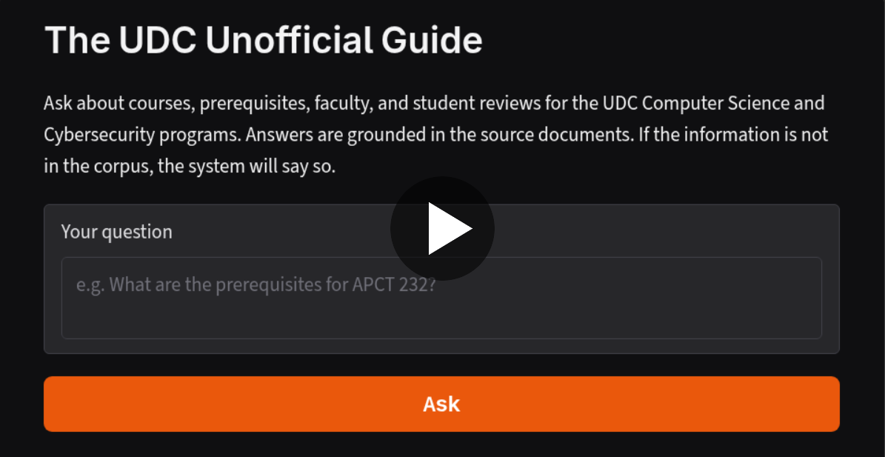

# The Unofficial Guide — Project 1

**Demo video -- click to watch:**

---

## Domain

This UDC unofficial guide covers academic navigation within the Computer Science and Cybersecurity programs at the University of the District of Columbia (UDC). Specifically, it answers questions about prerequisite chains, course content, faculty teaching styles, and program structure for the BSCS, BS Cybersecurity, MSCS, and MS Cybersecurity tracks.

This knowledge is valuable because navigating an engineering degree requires understanding strict prerequisite dependencies and course workloads to avoid graduation delays. It is hard to find through official channels because the university website only provides idealized curriculum checklists and generic course descriptions. This guide pairs the institutional rules from catalogs and syllabi with student evaluations from RateMyProfessors. RateMyProfessors reviews are not an authoritative source: they reflect a self-selected subset of students and can carry strong bias for or against a professor. Responses about faculty should be read as a snapshot of student opinion, not an objective assessment.

---

## Document Sources

| #   | Source                                  | Type         | URL or file path                                                   |
| --- | --------------------------------------- | ------------ | ------------------------------------------------------------------ |
| 1   | BSCS Handout                            | PDF          | `documents/bscs-handout.pdf`                                       |
| 2   | SEAS Catalog 2024-2026                  | Word (.docx) | `documents/2024-2026-UDC-Catalog-word.docx`                        |
| 3   | CS Syllabi Archive                      | PDF          | `documents/Syllabi_Computer_Science.pdf`                           |
| 4   | Cybersecurity Syllabi Archive           | PDF          | `documents/Syllabi_Cybersecurity.pdf`                              |
| 5   | UDC Links Master File                   | Markdown     | `documents/udc_links.md`                                           |
| 6   | Department Main Page                    | Web          | `https://www.udc.edu/seas/computer-science/`                       |
| 7   | Program Track: BSCS                     | Web          | `https://www.udc.edu/seas/computer-science/bs-in-computer-science` |
| 8   | Program Track: BS Cybersecurity         | Web          | `https://www.udc.edu/seas/computer-science/bs-cybersecurity`       |
| 9   | Program Track: MSCS                     | Web          | `https://www.udc.edu/seas/computer-science/ms-in-computer-science` |
| 10  | Program Track: MS Cybersecurity         | Web          | `https://www.udc.edu/seas/computer-science/ms-in-cybersecurity`    |
| 11  | Program Track: ABM CS                   | Web          | `https://www.udc.edu/seas/computer-science/abm-cs`                 |
| 12  | Official Prerequisite Map               | Web          | `https://www.udc.edu/seas/computer-science/prerequisite`           |
| 13  | Faculty Profile: Dr. Amir Alipour-Fanid | Web          | `https://www.udc.edu/directory/profiles/seas/amir-alipour-fanid`   |
| 14  | Faculty Profile: Prof. Uzma Amir        | Web          | `https://www.udc.edu/directory/profiles/seas/uzma-amir`            |
| 15  | Faculty Profile: Dr. Sandra Brooks      | Web          | `https://www.udc.edu/directory/profiles/seas/sandra-brooks`        |
| 16  | Faculty Profile: Dr. Li Chen            | Web          | `https://www.udc.edu/directory/profiles/seas/li-chen`              |
| 17  | Faculty Profile: Dr. Anteneh Girma      | Web          | `https://www.udc.edu/directory/profiles/seas/anteneh-girma`        |
| 18  | Faculty Profile: Dr. Dong Hyun Jeong    | Web          | `https://www.udc.edu/directory/profiles/seas/dong-jeong`           |
| 19  | Faculty Profile: Dr. Thabet Kacem       | Web          | `https://www.udc.edu/directory/profiles/seas/thabet-kacem`         |
| 20  | Faculty Profile: Dr. Junwhan Kim        | Web          | `https://www.udc.edu/directory/profiles/seas/justin-kim`           |
| 21  | Faculty Profile: Dr. Lily Liang         | Web          | `https://www.udc.edu/directory/profiles/seas/lily-liang`           |
| 22  | Faculty Profile: Dr. Hanney Shaban      | Web          | `https://www.udc.edu/directory/profiles/seas/hanney-shaban`        |
| 23  | Faculty Profile: Dr. Briana Wellman     | Web          | `https://www.udc.edu/directory/profiles/seas/briana-wellman`       |
| 24  | Faculty Profile: Dr. Byunggu Yu         | Web          | `https://www.udc.edu/directory/profiles/seas/byunggu-yu`           |
| 25  | Faculty Profile: Prof. Temechu Zewdie   | Web          | `https://www.udc.edu/directory/profiles/seas/temechu-zewdie`       |
| 26  | RateMyProfessors: Prof. Uzma Amir       | Web          | `https://www.ratemyprofessors.com/professor/2187367`               |
| 27  | RateMyProfessors: Dr. Li Chen           | Web          | `https://www.ratemyprofessors.com/professor/782290`                |
| 28  | RateMyProfessors: Dr. Anteneh Girma     | Web          | `https://www.ratemyprofessors.com/professor/3066315`               |
| 29  | RateMyProfessors: Dr. Dong Hyun Jeong   | Web          | `https://www.ratemyprofessors.com/professor/2190879`               |
| 30  | RateMyProfessors: Dr. Thabet Kacem      | Web          | `https://www.ratemyprofessors.com/professor/2774154`               |
| 31  | RateMyProfessors: Dr. Junwhan Kim       | Web          | `https://www.ratemyprofessors.com/professor/1929211`               |
| 32  | RateMyProfessors: Dr. Lily Liang        | Web          | `https://www.ratemyprofessors.com/professor/782307`                |
| 33  | RateMyProfessors: Dr. Hanney Shaban     | Web          | `https://www.ratemyprofessors.com/professor/1812839`               |
| 34  | RateMyProfessors: Prof. Temechu Zewdie  | Web          | `https://www.ratemyprofessors.com/professor/2941232`               |

---

## Chunking Strategy

**Chunk size:** 1000 characters maximum (~250 tokens) using recursive character splitting.

**Overlap:** 150 characters (15%).

**Why these choices fit your documents:** I use recursive character splitting rather than a plain fixed-size sliding window because my documents have strong explicit structure that lines up with topic boundaries. The splitter tries a priority list of separators (paragraph break, then line, then sentence, then word) and only falls back to a smaller separator when a piece still exceeds the size limit. Each syllabus block (course description, required textbook, objectives, topics), each faculty profile, and the review clusters stay intact rather than being cut mid-sentence. The 1000-character cap is large enough to hold one complete unit of meaning (one course description plus objectives, one faculty bio, or a cluster of reviews for the same professor) but small enough that a query about a specific course does not compete with unrelated text in the same chunk. The 15% overlap is intentionally modest because the short review and profile documents are already self-contained.

**Final chunk count:** 433 chunks across all 34 sources.

---

## Embedding Model

**Model used:** `all-MiniLM-L6-v2`. Stored in ChromaDB.

**Production tradeoff reflection:** The main limitations of `all-MiniLM-L6-v2` in this domain are context length and domain accuracy. Its 256-token input limit forces small chunks, which can split a full syllabus or a long degree-requirement section across multiple chunks, requiring retrieval to reassemble the answer from parts. A longer-context model would allow embedding an entire course syllabus as a single unit, improving recall on questions that span a whole course. MiniLM is general-purpose and can struggle to separate semantically similar items, like adjacent course numbers (APCT 231 vs APCT 232), similar faculty research areas, or two professors with comparable review language.

---

## Grounded Generation

**System prompt grounding instruction:** The system prompt uses absolute constraints rather than polite suggestions. The exact instruction is: "Answer ONLY using the numbered context passages provided in the user message. Do not use outside knowledge, training data, or general facts about universities or degree programs." The model is also given an explicit fallback phrase to use when the answer is absent from the context ("I don't have that information in my sources."), which makes the no-answer case testable. Temperature is set to 0.0 to prevent creative generation.

**How source attribution is surfaced in the response:** Source attribution is handled entirely in Python, not by the LLM. The `_format_sources()` function reads the `source` and `doc_type` metadata fields from each retrieved chunk after the LLM call returns, deduplicates them, and appends a formatted list to the answer string. The model is explicitly told not to add a references section. This means sources are always present and always accurate regardless of whether the model chose to mention them which can include sources that are not part of the answer.

---

## Evaluation Report

| #   | Question                                                                                                            | Expected answer                                                                                                                               | System response (summarized)                                                                                                                                            | Retrieval quality                                                                                                 | Response accuracy  |
| --- | ------------------------------------------------------------------------------------------------------------------- | --------------------------------------------------------------------------------------------------------------------------------------------- | ----------------------------------------------------------------------------------------------------------------------------------------------------------------------- | ----------------------------------------------------------------------------------------------------------------- | ------------------ |
| 1   | What are the prerequisites and co-requisites for APCT 232 (Computer Science II Lecture)?                            | Prerequisite: APCT 231/233. Co-requisite: APCT 234.                                                                                           | Correct: "The prerequisite for APCT 232 is APCT 231, and the co-requisite is APCT 234."                                                                                 | Relevant                                                                                                          | Accurate           |
| 2   | Which textbook is used for APCT 110/111 Introduction to Programming, and who coordinates the course?                | "Programming in Python 3" (electronic interactive textbook); coordinated by Dr. Briana Wellman.                                               | Correct: named the same textbook and coordinator.                                                                                                                       | Partially relevant (3 of 5 retrieved chunks were from unrelated syllabi; correct chunk was present at position 2) | Accurate           |
| 3   | What lab software or simulator is used in the networking course CYSE 210?                                           | CompTIA Network+ N10-007 Hands-on Lab Simulator (TestOut), free at testout.com.                                                               | "I don't have that information in my sources."                                                                                                                          | Partially relevant (retrieved CYSE 210 catalog and syllabus descriptions but none mentioned lab software)         | Inaccurate         |
| 4   | Which cybersecurity course covers reverse engineering and malware analysis, and what hands-on work does it involve? | CYSE 320; static and dynamic malware analysis, obfuscated malware; textbooks "Practical Reverse Engineering" and "Learning Malware Analysis." | Correct course and hands-on work (static/dynamic analysis, memory forensics, reverse engineering tools); did not name the specific textbooks.                           | Relevant                                                                                                          | Partially accurate |
| 5   | What do students say about Dr. Li Chen's project expectations and lecture style?                                    | Summary grounded in RMP reviews: commentary on project workload and teaching style, attributed to source.                                     | Correctly cited: class is "easy," grade visibility low; also cited a positive review calling him "dedicated" and a "caring instructor"; noted class is "LECTURE HEAVY." | Partially relevant (positions 4-5 returned unrelated professors; correct Li Chen chunks were at positions 1-2)    | Accurate           |

**Retrieval quality:** Relevant / Partially relevant / Off-target  
**Response accuracy:** Accurate / Partially accurate / Inaccurate

---

## Failure Case Analysis

**Question that failed:** What lab software or simulator is used in the networking course CYSE 210?

**What the system returned:** "I don't have that information in my sources." The system correctly declined to answer rather than hallucinating, which is the intended behavior of the grounding constraint. However, the expected answer (the CompTIA Network+ N10-007 Hands-on Lab Simulator, distributed via TestOut) does exist in the Cybersecurity Syllabi Archive.

**Root cause (tied to a specific pipeline stage):** The failure is a vocabulary mismatch at the retrieval stage. The query uses the words "lab software" and "simulator," but the syllabus describes the tool as "CompTIA Network+ N10-007 Hands-on Lab Simulator" and references "testout.com." The embedding model has no bridge between these phrasings, so the relevant chunk ranked below the top 5 and never reached the LLM. The CYSE 210 chunks that were retrieved described the course's exam-prep objective (CompTIA Network+) but not the specific lab tool name.

**What you would change to fix it:** Using a larger retrieval window (k=8 or k=10) during development would make it easier to inspect whether the right chunk exists at a lower rank before concluding it is absent from the corpus entirely.

---

## Spec Reflection

**One way the spec helped you during implementation:** Defining the chunking parameters in planning.md before writing any code made implementation straightforward. Because the chunk size (1000 characters), overlap (150 characters), separator priority list, and embedding model were all decided first, the implementation was a direct transcription of the spec.

**One way your implementation diverged from the spec, and why:** The Documents table in planning.md listed Electrical Engineering and Mechanical Engineering syllabi archives as sources. Both were dropped because they are scanned image PDFs with zero extractable text, and I decided to focus specifically in CS and Cyber.

---

## AI Usage

**Instance 1**

- _What I gave the AI:_ The Documents table, the Chunking Strategy section from planning.md, and the pipeline diagram. I described the corpus as a mix of PDFs (syllabi, catalog, handout), one Markdown file, and scraped web pages (faculty profiles, RateMyProfessors).
- _What it produced:_ A three-stage pipeline: `collect_raw.py` (fetch and save raw text), `clean.py`, and `ingest.py` (chunk with 1000-character recursive splitting and 150-character overlap). Each chunk carries metadata for source, program, person, and doc_type.
- _What I changed or overrode:_ The initial cleaning applied frequency-based chrome detection to all pages, including RateMyProfessors. This incorrectly removed the per-review labels (Quality, Difficulty, Grade, Textbook) because they repeat on every review and every professor page. I split the cleaning into two separate code paths: frequency detection for UDC pages only, and a targeted footer-cut for RMP pages.

**Instance 2**

- _What I gave the AI:_ The Milestone 5 requirements from planning.md, the architecture diagram, and the existing `retrieve()` function signature.
- _What it produced:_ `app.py` with a `generate_response()` function.
- _What I changed or overrode:_ The initial system prompt used polite language ("please use only the provided context") that left the model room to draw on outside knowledge. I rewrote it to use absolute constraints ("Answer ONLY", "Do not use outside knowledge") and added an explicit fallback phrase the model must produce when the answer is absent, making the no-answer case testable.
