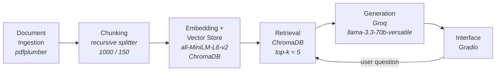

# Project 1 Planning: The Unofficial Guide

> Write this document before you write any pipeline code.
> Your spec and architecture diagram are what you'll use to direct AI tools (Claude, Copilot, etc.) to generate your implementation — the more specific they are, the more useful the generated code will be.
> Update the Retrieval Approach and Chunking Strategy sections if you change your approach during implementation.
> Update this file before starting any stretch features.

---

## Domain

<!-- What domain did you choose? Why is this knowledge valuable and hard to find through official channels? -->

The chosen domain is the academic navigation, prerequisite sequencing, and faculty dynamics within the Computer Science and Cybersecurity programs at the University of the District of Columbia (UDC).

This knowledge is highly valuable because navigating engineering and computing degrees requires a strategic understanding of strict prerequisite chains and varying course workloads to avoid graduation delays. It is exceptionally hard to find through official channels because university websites and catalogs only provide idealized, linear curriculum checklists and generic course descriptions. They completely omit the qualitative student realities, actual time commitments, software stacks used, and individual faculty teaching or grading styles that directly impact a student's academic success. This guide bridges that gap by pairing rigid institutional rules with real-world student evaluation data.

---

## Documents

<!-- List your specific sources: URLs, subreddit names, forum threads, or file descriptions.
     Aim for at least 10 sources that together cover different subtopics or perspectives within your domain. -->

| #   | Source                         | Description                                                                                                                                                                                                                                                                         | URL or location                                                    |
| --- | ------------------------------ | ----------------------------------------------------------------------------------------------------------------------------------------------------------------------------------------------------------------------------------------------------------------------------------- | ------------------------------------------------------------------ |
| 1   | BSCS Handout                   | Official undergraduate Computer Science curriculum checklist and sequence layout.                                                                                                                                                                                                   | `documents/bscs-handout.pdf`                                       |
| 2   | SEAS Catalog (2024-2026)       | Complete academic catalog detailing official regulations, degree requirements, and current core course definitions for SEAS.                                                                                                                                                        | `documents/SEAS-2024-2026-UDC-Catalog.pdf`                         |
| 3   | CS Syllabi Archive             | Aggregated syllabi from previous academic years. While specific timelines or policies may be outdated compared to the current catalog, these files offer deep, granular information regarding course structures, exam weights, and software dependencies unavailable anywhere else. | `documents/Syllabi_Computer_Science.pdf`                           |
| 4   | Cybersecurity Syllabi Archive  | Aggregated historical syllabi for Cybersecurity tracks. Though details may vary across semesters, these documents provide essential context on hands-on lab environments, specific hacking/defense tools, and assignment depth.                                                     | `documents/Syllabi_Cybersecurity.pdf`                              |
| 5   | EE Syllabi Archive             | Aggregated past syllabi for Electrical Engineering courses. Outdated regarding current dates, but highly useful for understanding cross-listed hardware, architecture, and networking course layouts.                                                                               | `documents/Syllabi_Electrical_Engineering.pdf`                     |
| 6   | ME Syllabi Archive             | Aggregated archival syllabi for Mechanical Engineering courses within the school of engineering, detailing historical project guidelines and workloads.                                                                                                                             | `documents/Syllabi_Mechanical_Engineering.pdf`                     |
| 7   | UDC Links Master File          | Markdown index compiling departmental portals, degree pathways, and specific faculty registries.                                                                                                                                                                                    | `documents/udc_links.md`                                           |
| 8   | Department Main Page           | Official landing page for the Department of Computer Science and Information Technology.                                                                                                                                                                                            | `https://www.udc.edu/seas/computer-science/`                       |
| 9   | Program Track: BSCS            | Official curriculum page outlining the Bachelor of Science in Computer Science.                                                                                                                                                                                                     | `https://www.udc.edu/seas/computer-science/bs-in-computer-science` |
| 10  | Program Track: BS Cyber        | Official curriculum page outlining the Bachelor of Science in Cybersecurity.                                                                                                                                                                                                        | `https://www.udc.edu/seas/computer-science/bs-cybersecurity`       |
| 11  | Program Track: MSCS            | Official curriculum page outlining the Master of Science in Computer Science.                                                                                                                                                                                                       | `https://www.udc.edu/seas/computer-science/ms-in-computer-science` |
| 12  | Program Track: MS Cyber        | Official curriculum page outlining the Master of Science in Cybersecurity.                                                                                                                                                                                                          | `https://www.udc.edu/seas/computer-science/ms-in-cybersecurity`    |
| 13  | Program Track: ABM CS          | Official requirements for the Accelerated Bachelor's-to-Master's program track in Computer Science.                                                                                                                                                                                 | `https://www.udc.edu/seas/computer-science/abm-cs`                 |
| 14  | Official Prerequisite Map      | The department's formal course dependency and prerequisite constraint rules.                                                                                                                                                                                                        | `https://www.udc.edu/seas/computer-science/prerequisite`           |
| 15  | Faculty Profile: Dr. Fanid     | Official research areas, lab groups, and contact details for Dr. Amir Alipour-Fanid.                                                                                                                                                                                                | `https://www.udc.edu/directory/profiles/seas/amir-alipour-fanid`   |
| 16  | Faculty Profile: Prof. Amir    | Official teaching focus and academic background for Professor Uzma Amir.                                                                                                                                                                                                            | `https://www.udc.edu/directory/profiles/seas/uzma-amir`            |
| 17  | Faculty Profile: Dr. Brooks    | Official profile and department involvement details for Dr. Sandra Brooks.                                                                                                                                                                                                          | `https://www.udc.edu/directory/profiles/seas/sandra-brooks`        |
| 18  | Faculty Profile: Dr. Chen      | Official research portfolio and teaching background for Dr. Li Chen.                                                                                                                                                                                                                | `https://www.udc.edu/directory/profiles/seas/li-chen`              |
| 19  | Faculty Profile: Dr. Girma     | Official cybersecurity specializations and teaching profile for Dr. Anteneh Girma.                                                                                                                                                                                                  | `https://www.udc.edu/directory/profiles/seas/anteneh-girma`        |
| 20  | Faculty Profile: Dr. Jeong     | Official profile detailing data visualization research and academic focus for Dr. Dong Hyun Jeong.                                                                                                                                                                                  | `https://www.udc.edu/directory/profiles/seas/dong-jeong`           |
| 21  | Faculty Profile: Dr. Kacem     | Official profile detailing transit security and mobile networking research for Dr. Thabet Kacem.                                                                                                                                                                                    | `https://www.udc.edu/directory/profiles/seas/thabet-kacem`         |
| 22  | Faculty Profile: Dr. Kim       | Official profile and engineering focus details for Dr. Justin (Junwhan) Kim.                                                                                                                                                                                                        | `https://www.udc.edu/directory/profiles/seas/justin-kim`           |
| 23  | Faculty Profile: Dr. Liang     | Official profile detailing computer vision and digital image processing labs for Dr. Lily Liang.                                                                                                                                                                                    | `https://www.udc.edu/directory/profiles/seas/lily-liang`           |
| 24  | Faculty Profile: Dr. Shaban    | Official teaching focus and cybersecurity networks research background for Dr. Hanney Shaban.                                                                                                                                                                                       | `https://www.udc.edu/directory/profiles/seas/hanney-shaban`        |
| 25  | Faculty Profile: Dr. Wellman   | Official profile establishing leadership, department administration, and research focus for Dr. Briana Wellman.                                                                                                                                                                     | `https://www.udc.edu/directory/profiles/seas/briana-wellman`       |
| 26  | Faculty Profile: Dr. Yu        | Official database systems and spatial data research profile for Dr. Byunggu Yu.                                                                                                                                                                                                     | `https://www.udc.edu/directory/profiles/seas/byunggu-yu`           |
| 27  | Faculty Profile: Prof. Zewdie  | Official profile and teaching focus areas for Professor Temechu Zewdie.                                                                                                                                                                                                             | `https://www.udc.edu/directory/profiles/seas/temechu-zewdie`       |
| 28  | RateMyProfessors: Prof. Amir   | Crowdsourced student evaluations tracking class clarity, grading style, and textbook reliance for Professor Uzma Amir.                                                                                                                                                              | `https://www.ratemyprofessors.com/professor/2187367`               |
| 29  | RateMyProfessors: Dr. Chen     | Student evaluations tracking project expectations and lecture styles over time for Dr. Li Chen.                                                                                                                                                                                     | `https://www.ratemyprofessors.com/professor/782290`                |
| 30  | RateMyProfessors: Dr. Girma    | Student reviews assessing grading strictness and assignment structures for Dr. Anteneh Girma.                                                                                                                                                                                       | `https://www.ratemyprofessors.com/professor/3066315`               |
| 31  | RateMyProfessors: Dr. Jeong    | Direct student feedback assessing course delivery, project difficulty, and exam fairness for Dr. Dong Hyun Jeong.                                                                                                                                                                   | `https://www.ratemyprofessors.com/professor/2190879`               |
| 32  | RateMyProfessors: Dr. Kacem    | Profile landing page for Dr. Thabet Kacem. Note: This professor currently has no active student ratings or numerical scores posted.                                                                                                                                                 | `https://www.ratemyprofessors.com/professor/2774154`               |
| 33  | RateMyProfessors: Dr. Kim      | Peer reviews detailing class engagement and grading habits for Dr. Junwhan Kim.                                                                                                                                                                                                     | `https://www.ratemyprofessors.com/professor/1929211`               |
| 34  | RateMyProfessors: Dr. Liang    | Long-term student feedback mapping out coding rigor and exam formatting for Dr. Lily Liang.                                                                                                                                                                                         | `https://www.ratemyprofessors.com/professor/782307`                |
| 35  | RateMyProfessors: Dr. Shaban   | Student feedback detailing workload, cybersecurity assignment depth, and communication for Dr. Hanney Shaban.                                                                                                                                                                       | `https://www.ratemyprofessors.com/professor/1812839`               |
| 36  | RateMyProfessors: Prof. Zewdie | Profile landing page for Professor Zewdie Temechu. Note: This professor currently has no active student ratings or numerical scores posted.                                                                                                                                         | `https://www.ratemyprofessors.com/professor/2941232`               |

---

## Chunking Strategy

<!-- How will you split documents into chunks?
     State your chunk size (in tokens or characters), overlap size, and explain why those
     numbers fit the structure of your documents.
     A review-heavy corpus warrants different chunking than a long FAQ. -->

**Chunk size:** 1000 characters (about 250 tokens) maximum per chunk, using recursive character splitting.

**Overlap:** 150 characters (15%).

**Reasoning:** I use recursive character splitting rather than a plain fixed-size sliding window because my documents have strong explicit structure that lines up with topic boundaries. The splitter tries a priority list of separators (paragraph break `\n\n`, then line `\n`, then sentence, then word) and only falls back to a smaller separator when a piece is still over the size limit. It cuts on natural boundaries instead of slicing mid-sentence: each syllabus block (course description, required textbook, objectives, topics covered), each faculty profile, and the review clusters stay intact instead of being severed by a blind 1000-character cut. I considered semantic chunking but rejected it, because my documents already carry the structural delimiters that semantic chunking tries to rediscover, so recursive splitting captures the same boundaries directly.

My documents are semantically dense, and each syllabus is a short self-contained block, faculty profiles are a few hundred words; and RateMyProfessors entries are short individual reviews. A 1000-character cap is large enough to hold a complete unit of meaning (one course's description plus objectives, one faculty bio, or a cluster of reviews for the same professor) but small enough that a query about a specific course or professor does not have to compete with unrelated text in the same chunk. I keep overlap modest (rather than larger) because the short review and profile documents are already self-contained, and heavy overlap there would just duplicate whole reviews and inflate the database without improving retrieval.

---

## Retrieval Approach

<!-- Which embedding model are you using (e.g., all-MiniLM-L6-v2 via sentence-transformers)?
     How many chunks will you retrieve per query (top-k)?
     If you were deploying this for real users and cost wasn't a constraint, what tradeoffs
     would you weigh in choosing a different embedding model — context length, multilingual
     support, accuracy on domain-specific text, latency? -->

**Embedding model:** `all-MiniLM-L6-v2`

**Top-k:** 5. My chunks are small (about 250 tokens), so a single chunk rarely holds a full answer on its own. Retrieving 5 gives the generator enough coverage to assemble a grounded answer while staying low enough that the prompt is not flooded with loosely related chunks that pull the response off-topic. I will tune this during the evaluation phase if I see relevant chunks falling just outside the top results.

**Production tradeoff reflection:** I would think the main trade offs are the context length and domain accuracy. The biggest limitation of `all-MiniLM-L6-v2` is its short context window: it forces me to keep chunks small, which can split a full syllabus or a long degree-requirement section across multiple chunks. A longer-context model would let me embed an entire course syllabus or faculty profile as one unit, improving recall on questions that span a whole course. On domain accuracy, MiniLM is general-purpose and can struggle to separate semantically close items like adjacent course numbers, similar faculty research areas, or two professors with comparable reviews; a stronger or larger model would give sharper separation on this technical, name-heavy text. Multilingual support is not a real factor here because my corpus is entirely English.

---

## Evaluation Plan

<!-- List your 5 test questions with their expected correct answers.
     Questions should be specific enough that you can judge whether the system's response
     is right or wrong. "What are good dining halls?" is too vague.
     "What do students say about wait times at [dining hall name] during lunch?" is testable. -->

| #   | Question                                                                                                            | Expected answer                                                                                                                                                                                                                                                                                        |
| --- | ------------------------------------------------------------------------------------------------------------------- | ------------------------------------------------------------------------------------------------------------------------------------------------------------------------------------------------------------------------------------------------------------------------------------------------------ |
| 1   | What are the prerequisites and co-requisites for APCT 232 (Computer Science II Lecture)?                            | Prerequisite: APCT 231/233. Co-requisite: APCT 234. (Source: CS Syllabi Archive)                                                                                                                                                                                                                       |
| 2   | Which textbook is used for APCT 110/111 Introduction to Programming, and who coordinates the course?                | The zyBooks electronic interactive textbook "Programming in Python 3"; coordinated by Dr. Briana Wellman. (Source: CS Syllabi Archive)                                                                                                                                                                 |
| 3   | What lab software or simulator is used in the networking course CYSE 210?                                           | The CompTIA Network+ N10-007 Hands-on Lab Simulator (TestOut), included free on the companion site at testout.com. (Source: Cybersecurity Syllabi Archive)                                                                                                                                             |
| 4   | Which cybersecurity course covers reverse engineering and malware analysis, and what hands-on work does it involve? | CYSE 320: Reverse Engineering and Malware Analysis. Students perform static and dynamic analysis of malware (including obfuscated malware) using reverse engineering tools; textbooks include "Practical Reverse Engineering" and "Learning Malware Analysis." (Source: Cybersecurity Syllabi Archive) |
| 5   | What do students say about Dr. Li Chen's project expectations and lecture style?                                    | A summary grounded in the RateMyProfessors reviews for Dr. Chen (Source #29), e.g., commentary on project workload and teaching style. The key test is that the answer is attributed to the review source and is not invented or drawn from general knowledge.                                         |

---

## Anticipated Challenges

<!-- What could go wrong? Name at least two specific risks with reasoning.
     Consider: noisy or inconsistent documents, missing source attribution, off-topic
     retrieval, chunks that split key information across boundaries. -->

1. **Conflicting authority between archival syllabi and the current catalog.** My syllabi are aggregated from previous years and may list outdated prerequisites, textbooks, or policies, while the SEAS 2024-2026 catalog is current. A query about a course's prerequisites could retrieve a stale syllabus chunk that contradicts the catalog, and the embedding model has no notion of which source is more recent.

2. **Cross-program and cross-faculty collisions in retrieval.** The corpus mixes CS, Cybersecurity, EE, and ME syllabi plus many faculty with overlapping research areas. Generic terms like "networks," "security," and "data structures," and reused course-number patterns, appear across multiple programs, so semantic search may return an EE or ME chunk for a CS question, or blend two professors with similar profiles into one answer.

---

## Architecture

<!-- Draw a diagram of your pipeline showing the five stages:
     Document Ingestion → Chunking → Embedding + Vector Store → Retrieval → Generation
     Label each stage with the tool or library you're using.
     You can use ASCII art, a Mermaid diagram, or embed a sketch as an image.
     You'll use this diagram as context when prompting AI tools to implement each stage. -->

---

## AI Tool Plan

<!-- For each part of the pipeline below, describe:
     - Which AI tool you plan to use (Claude, Copilot, ChatGPT, etc.)
     - What you'll give it as input (which sections of this planning.md, which requirements)
     - What you expect it to produce
     - How you'll verify the output matches your spec

     "I'll use AI to help me code" is not a plan.
     "I'll give Claude my Chunking Strategy section and ask it to implement chunk_text()
     with my specified chunk size and overlap" is a plan. -->

**Milestone 3, Ingestion and chunking:**

- _Tool:_ Claude
- _Input I will give it:_ My Documents table, the Chunking Strategy section, and the pdfplumber snippet. I will tell it the corpus is a mix of PDFs (syllabi, catalog, BSCS handout), one Markdown file, and saved web pages (faculty profiles, RateMyProfessors).
- _What I expect it to produce:_ A `chunk_document()` function plus loaders that read each PDF with pdfplumber, read the Markdown directly, and parse the saved HTML, then clean each one (strip page numbers, headers/footers, navigation boilerplate, collapse whitespace) and return recursive-split chunks of 1000 characters with 150-character overlap, each carrying metadata for source, program, and person.
- _How I will verify:_ Print a sample of chunks and confirm they respect my spec, that is each chunk is 1000 characters or fewer, splits is within the boundaries, and the attached metadata.

**Milestone 4, Embedding and retrieval:**

- _Tool:_ Claude
- _Input I will give it:_ My Retrieval Approach section (embedding model `all-MiniLM-L6-v2`, top-k = 5) and the chunk objects produced.
- _What I expect it to produce:_ An `embed_and_store()` function that embeds chunks with sentence-transformers and writes them to ChromaDB with their metadata, and a `retrieve()` function that embeds the query, runs a semantic search, and returns the top 5 chunks with their text, metadata, and distance scores.
- _How I will verify:_ Run my 5 evaluation questions and print the retrieved chunks with distances. I will check that low distances correspond to clearly relevant chunks and that questions about a specific course or professor return chunks from the right source and program.

**Milestone 5, Generation and interface:**

- _Tool:_ Claude.
- _Input I will give it:_ The requirements to answer only from retrieved chunks and cite sources, the model id `llama-3.3-70b-versatile`, and the default Gradio interface.
- _What I expect it to produce:_ A `generate_response()` function that builds a prompt from the retrieved chunks and the question, calls the Groq model with instructions to use only the provided context, and returns an answer with source attribution.
- _How I will verify:_ Ask a question I know is answerable and confirm the answer is correct and cites the syllabus source. Then ask something not in any document and confirm the system says it does not know rather than inventing an answer.
